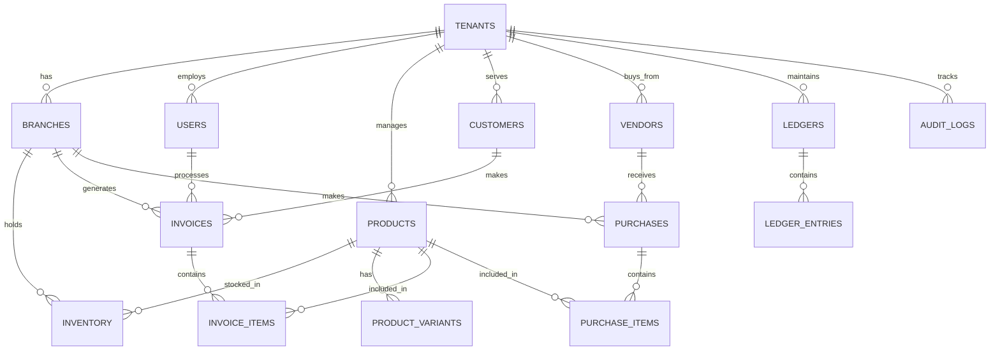

# Bill Sphere - PostgreSQL Database Schema

This document outlines the complete PostgreSQL schema design for Bill Sphere, supporting Multi-Tenant, Multi-Branch, Inventory, Billing, GST, Accounting, and Audit Logs.

## 1. ER Diagram

## 2. Table Definitions & Relationships

Every table (except global system tables) will include `tenant_id` to enforce multi-tenant data isolation.

### 2.1 Core Business & Multi-Branch
- **tenants** (Businesses)
  - `tenant_id` (UUID, PK)
  - `business_name` (VARCHAR), `gst_number` (VARCHAR), `financial_year_start` (DATE)
- **branches**
  - `branch_id` (UUID, PK)
  - `tenant_id` (UUID, FK)
  - `branch_name` (VARCHAR), `address` (TEXT), `gst_number` (VARCHAR)

### 2.2 Employees & Roles
- **users** (Employees)
  - `user_id` (UUID, PK)
  - `tenant_id` (UUID, FK)
  - `branch_id` (UUID, FK)
  - `name` (VARCHAR), `email` (VARCHAR), `phone` (VARCHAR), `role_id` (UUID, FK), `password_hash` (VARCHAR)
- **roles** (Owner, Manager, Cashier, etc.)
  - `role_id` (UUID, PK)
  - `role_name` (VARCHAR), `permissions` (JSONB)

### 2.3 Customers & Vendors
- **customers**
  - `customer_id` (UUID, PK)
  - `tenant_id` (UUID, FK)
  - `name` (VARCHAR), `phone` (VARCHAR), `gst_number` (VARCHAR), `credit_limit` (DECIMAL), `reward_points` (INT)
- **vendors**
  - `vendor_id` (UUID, PK)
  - `tenant_id` (UUID, FK)
  - `name` (VARCHAR), `phone` (VARCHAR), `gst_number` (VARCHAR), `outstanding_balance` (DECIMAL)

### 2.4 Product & Inventory
- **products**
  - `product_id` (UUID, PK)
  - `tenant_id` (UUID, FK)
  - `name` (VARCHAR), `category_id` (UUID, FK), `hsn_code` (VARCHAR), `tax_rate` (DECIMAL)
- **product_variants**
  - `variant_id` (UUID, PK)
  - `product_id` (UUID, FK)
  - `barcode` (VARCHAR), `sku` (VARCHAR), `selling_price` (DECIMAL), `purchase_price` (DECIMAL)
- **inventory**
  - `inventory_id` (UUID, PK)
  - `tenant_id` (UUID, FK)
  - `branch_id` (UUID, FK)
  - `variant_id` (UUID, FK)
  - `quantity` (INT), `batch_number` (VARCHAR), `expiry_date` (DATE)

### 2.5 Billing & GST
- **invoices**
  - `invoice_id` (UUID, PK)
  - `tenant_id` (UUID, FK)
  - `branch_id` (UUID, FK)
  - `customer_id` (UUID, FK)
  - `user_id` (UUID, FK - Cashier)
  - `invoice_number` (VARCHAR), `type` (VARCHAR - Retail/GST/Tax), `total_amount` (DECIMAL)
  - `cgst` (DECIMAL), `sgst` (DECIMAL), `igst` (DECIMAL), `status` (VARCHAR - Paid/Unpaid)
- **invoice_items**
  - `item_id` (UUID, PK)
  - `invoice_id` (UUID, FK)
  - `variant_id` (UUID, FK)
  - `quantity` (INT), `unit_price` (DECIMAL), `discount` (DECIMAL), `tax_amount` (DECIMAL), `total_price` (DECIMAL)
- **payments**
  - `payment_id` (UUID, PK)
  - `invoice_id` (UUID, FK)
  - `payment_method` (VARCHAR - Cash/UPI/Card), `amount` (DECIMAL), `status` (VARCHAR)

### 2.6 Purchases
- **purchases**
  - `purchase_id` (UUID, PK)
  - `tenant_id` (UUID, FK)
  - `branch_id` (UUID, FK)
  - `vendor_id` (UUID, FK)
  - `purchase_number` (VARCHAR), `total_amount` (DECIMAL), `status` (VARCHAR)
- **purchase_items**
  - `item_id` (UUID, PK)
  - `purchase_id` (UUID, FK)
  - `variant_id` (UUID, FK)
  - `quantity` (INT), `unit_price` (DECIMAL)

### 2.7 Accounting
- **ledgers**
  - `ledger_id` (UUID, PK)
  - `tenant_id` (UUID, FK)
  - `type` (VARCHAR - Sales, Purchase, Customer, Vendor, Cash, Bank)
  - `name` (VARCHAR), `balance` (DECIMAL)
- **ledger_entries**
  - `entry_id` (UUID, PK)
  - `ledger_id` (UUID, FK)
  - `transaction_date` (TIMESTAMP), `amount` (DECIMAL), `type` (VARCHAR - Credit/Debit), `reference_id` (UUID)

### 2.8 Audit Logs
- **audit_logs**
  - `log_id` (UUID, PK)
  - `tenant_id` (UUID, FK)
  - `user_id` (UUID, FK)
  - `table_name` (VARCHAR), `record_id` (UUID), `action` (VARCHAR - INSERT/UPDATE/DELETE)
  - `old_values` (JSONB), `new_values` (JSONB), `timestamp` (TIMESTAMP)

## 3. Index Strategy

To ensure queries remain under the performance requirements (< 1 second / < 2 seconds for billing), the following index strategy will be applied:

- **Multi-Tenant Isolation**: Every table with a `tenant_id` will have a composite index `(tenant_id, primary_key)` or `(tenant_id, branch_id)`. This is crucial for multi-tenant query performance and offline synchronization subsets.
- **Search Optimization**: 
  - **GIN indexes** on `products(name)` and `customers(name, phone)` for fast text search and auto-complete during billing.
  - **B-tree index** on `product_variants(barcode)` for instant, sub-second barcode scanning operations.
- **Reporting & Analytics**:
  - **B-tree indexes** on `invoices(created_at, tenant_id, branch_id)` to speed up Sales Analytics, Daily Sales, and GST report generation.
  - Index on `inventory(tenant_id, branch_id, quantity)` to quickly identify low stock and dead stock.
- **Audit Trails**:
  - **BRIN (Block Range INdex)** or **B-tree index** on `audit_logs(timestamp)` for efficient storage and fast time-series querying of historical audit logs.

## 4. Foreign Key Constraints & Relationships

- **ON DELETE CASCADE**: Applied carefully to relationships like `invoices -> invoice_items` and `purchases -> purchase_items`. Deleting an invoice removes its items.
- **ON DELETE RESTRICT**: Applied to critical relationships like `products -> inventory`, `customers -> invoices`, or `vendors -> purchases`. This prevents users from accidentally deleting products or customers that have an active financial and billing history.
- **Row-Level Security (RLS)**: PostgreSQL RLS policies will be strictly enforced on `tenant_id` across all tables. This guarantees data isolation—no application query can accidentally return data belonging to another tenant, providing a foolproof security layer.
